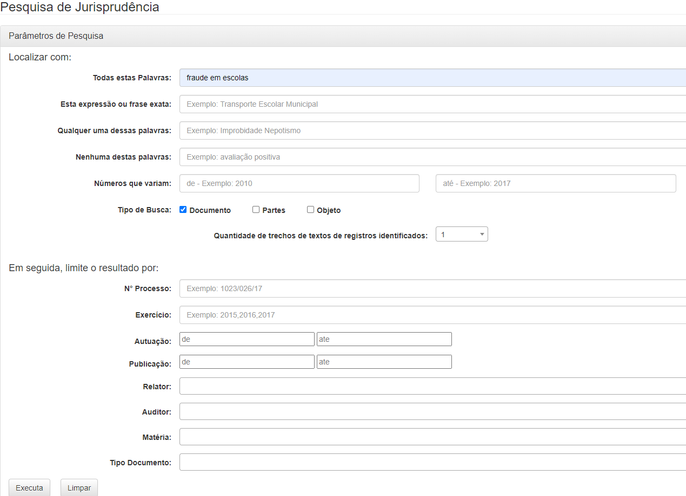
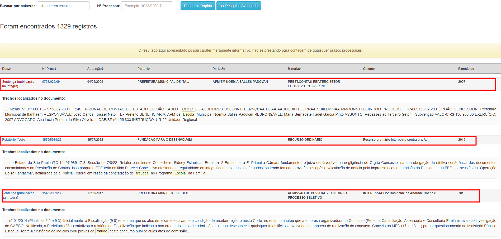

## Objetivo
Por um robô de automação de processos utilizando Python, é extraído todos os documentos do site do [TCE-SP](https://www.tce.sp.gov.br/jurisprudencia/), que sejam
relacionados a “fraude em escolas”, finalmente salve esses dados em formato estruturado JSON.


## Estrutura do site
<p align="center">
  <br>
  <b>TCE-SE - Página de pesquisa</b>
</p>

<p align="center">
  <br>
  <b>Dados</b>
</p>

<b>Funcionamento:</b>
O site implementa uma lógica de controle de sessão ou de requisições dinâmicas que gera links de resultados de busca que dependem do estado atual da sessão do navegador. Quando a busca é realizada, o servidor gera um link temporário que só pode ser acessado dentro da mesma sessão onde a busca foi iniciada.
Por esse motivo, o uso do Selenium se torna necessário. O Selenium permite a simulação completa da interação do usuário com o site, incluindo a execução da busca dentro da mesma sessão do navegador, garantindo assim que o link gerado seja válido e acessível. 

## Solução proposta
<b>Stacks:</b> Python (selenium, beautifulsoup4, webdriver-manager, pymongo)

<b>Funcionamento</b>:

1 - Configuração do Navegador: 
O script começa configurando o navegador Chrome para desativar notificações e maximizar a janela. Isso é feito usando a biblioteca selenium com opções específicas para o Chrome.

2 - Acesso ao Site e Execução da Busca: 
O navegador é direcionado para a página de jurisprudência do TCE-SP. Em seguida, o script aguarda até que a caixa de pesquisa seja carregada e insere o termo "fraude em escolas". O botão de busca é clicado para iniciar a pesquisa.

3 - Captura de Dados: 
O script extrai o número total de registros e o número total de páginas de resultados. Utiliza essa informação para iterar sobre cada página de resultados, navegando para a URL específica de cada página e extraindo os dados dos casos exibidos.

4 - Extração de Detalhes dos Casos: 
Para cada caso encontrado na página, o script extrai informações como número do processo, data de autuação, partes envolvidas, matéria e um link para mais detalhes. Essas informações são armazenadas em uma lista de dicionários JSON.

5 - Validação e Exportação dos Dados: 
Após extrair os dados de todas as páginas, o script valida se o número de registros extraídos corresponde ao número de registros esperado. Se a quantidade coincidir, os dados são exportados para um arquivo JSON. Caso contrário, uma mensagem de erro é exibida.

6- Salvamento no MongoDB (opcional): 
Embora comentada no código, há uma função para salvar os dados extraídos diretamente em uma coleção MongoDB, conectando-se ao banco de dados usando as variáveis de ambiente.

<b>Código</b>:
```
from selenium import webdriver
from selenium.webdriver.chrome.service import Service
from selenium.webdriver.chrome.options import Options
from selenium.webdriver.support.ui import WebDriverWait
from selenium.webdriver.support import expected_conditions as EC
from selenium.webdriver.common.by import By
from selenium.common.exceptions import NoSuchElementException, TimeoutException, WebDriverException
from bs4 import BeautifulSoup as bs
import json
import os
from webdriver_manager.chrome import ChromeDriverManager
from pymongo import MongoClient

# Configuração das opções do Chrome
chrome_options = Options()
chrome_options.add_argument('disable-notifications')  # Desativa notificações do navegador
chrome_options.add_argument('--disable-infobars')      # Desativa barras de informações
chrome_options.add_argument('start-maximized')         # Inicia o navegador maximizado
chrome_options.add_experimental_option("prefs", {"profile.default_content_setting_values.notifications": 2})  # Desativa notificações adicionais

# Inicializa o WebDriver com Service e as opções configuradas
service = Service(ChromeDriverManager().install())
browser = webdriver.Chrome(service=service, options=chrome_options)

# Configuração de conexão com MongoDB
def salvar_json_mongodb(lista_json):
    """Salva dados no banco de dados MongoDB.

    Args:
        lista_json (List): Lista de JSONs a ser salva.

    Raises:
        ValueError: Se a entrada não for uma lista de JSONs.
    """
    try:
        # Conecta ao MongoDB usando as variáveis de ambiente
        client = MongoClient(os.getenv("MONGO_URI"))
        db = client[os.getenv("MONGO_DB_NAME")]
        collection = db[os.getenv("MONGO_COLLECTION_NAME")]
        
        # Insere os documentos na coleção
        if isinstance(lista_json, list):
            collection.insert_many(lista_json)
            print(f"{len(lista_json)} documentos inseridos com sucesso!")
        else:
            raise ValueError("A entrada fornecida não é uma lista de JSON.")
    
    except Exception as e:
        print(f"Erro ao inserir documentos no MongoDB: {e}")
    
    finally:
        # Fecha a conexão com o MongoDB
        client.close()
        
# Função principal para extração de dados
def extrair_dados():
    """Acessa o site do TCE-SP com Selenium, captura dados página a página, e executa a exportação dos dados.

    Returns:
        JSON: Exportação dos dados capturados em formato JSON.
    """
    list_json_final = []  # Lista para armazenar os dados extraídos
    try:
        # Acessa a página inicial de jurisprudência do TCE-SP
        browser.get('https://www.tce.sp.gov.br/jurisprudencia/')
        
        # Aguarda até que a caixa de pesquisa esteja presente na página
        WebDriverWait(browser, 10).until(EC.presence_of_element_located((By.XPATH, '/html/body/form/div/div[2]/div[2]/div[1]/div/input')))

        # Localiza a caixa de texto de pesquisa e insere o termo 'fraude em escolas'
        search_box = browser.find_element(By.XPATH, '/html/body/form/div/div[2]/div[2]/div[1]/div/input')
        search_box.click()
        search_box.send_keys('fraude em escolas')

        # Clica no botão de execução da pesquisa
        browser.find_element(By.XPATH, '/html/body/form/div/div[2]/div[3]/div[9]/div/input[1]').click()

        # Captura e extrai a quantidade de registros esperada para validação
        qtde_registros_esperada_text = browser.find_element(By.XPATH, '/html/body/div[3]/h3').text.strip()
        qtde_registros_esperada = int(''.join([char for char in qtde_registros_esperada_text if char.isdigit()]))

        # Navega até a última página para determinar o número total de páginas
        browser.find_element(By.XPATH, '/html/body/nav/ul/li[9]/a').click()
        qtde_paginas_text = browser.find_element(By.XPATH, '/html/body/nav/ul/li[9]/span').text.strip()
        qtde_paginas = int(''.join([char for char in qtde_paginas_text if char.isdigit()]))

        # Laço de repetição para iterar sobre as páginas de resultados
        pagina = 0
        for n in range(qtde_paginas):  # Itera sobre todas as páginas, ajuste conforme necessário
            try:
                # Acessa a URL da página atual de resultados
                browser.get(f'https://www.tce.sp.gov.br/jurisprudencia/pesquisar?acao=Executa&offset={pagina}')
                html = browser.execute_script("return document.getElementsByTagName('html')[0].innerHTML")
                soup = bs(html, "html.parser")
                
                # Localiza os dados na tabela da página
                lista_de_dados = soup.findAll('tr', {'class': 'borda-superior'})[:-1]  # Remove o último 'tr' que não contém dados

                # Extrai os dados de cada item encontrado
                for item in lista_de_dados:
                    try:
                        doc = item.findAll('td', {'class': 'small'})[0].text.strip()
                        num_processo = item.findAll('td', {'class': 'small'})[1].text.strip()
                        data_autuacao = item.findAll('td', {'class': 'small'})[2].text.strip()
                        parte1 = item.findAll('td', {'class': 'small'})[3].text.strip()
                        parte2 = item.findAll('td', {'class': 'small'})[4].text.strip()
                        materia = item.findAll('td', {'class': 'small'})[5].text.strip()
                        url_item = item.findAll('td', {'class': 'small'})[0].find('a')['href']
                        list_json_final.append({
                            'doc': doc,
                            'num_processo': num_processo,
                            'data_autuacao': data_autuacao,
                            'partes': [parte1, parte2],
                            'materia': materia,
                            'url_item': url_item
                        })
                    except IndexError:
                        print("Erro ao extrair dados de um item")
                        continue

                # Atualiza o número da página para a próxima iteração
                print(f'Página {n} Extraída', end='\r')
                pagina += 10

            except TimeoutException:
                print(f"Timeout ao carregar a página {n}")
                continue

    except (NoSuchElementException, TimeoutException) as e:
        # Captura e exibe erros relacionados a elementos não encontrados ou timeout
        print(f"Erro durante a raspagem: {e}")

    finally:
        # Fecha o navegador após a execução
        browser.quit()

    # Validação dos registros e exportação dos dados para um arquivo JSON
    if qtde_registros_esperada == len(list_json_final):
        print(f"Quantidade de registros confere!\nQuantidade de registros esperada: {qtde_registros_esperada}\nQuantidade obtida: {len(list_json_final)}")
    else:
        print(f"Quantidade de registros não confere!\nQuantidade de registros esperada: {qtde_registros_esperada}\nQuantidade obtida: {len(list_json_final)}")

    # Salva os dados extraídos em um arquivo JSON
    output_file = os.path.join(os.path.dirname(os.path.abspath(__file__)), 'dados_json.json')
    try:
        with open(output_file, 'w') as file:
            json.dump(list_json_final, file, ensure_ascii=False, indent=4)
        print(f"Dados salvos!\n{output_file}")
        #salvar_json_mongodb(list_json_final)
    except IOError as e:
        # Captura e exibe erros relacionados à escrita do arquivo
        print(f"Erro ao salvar o arquivo: {e}")

# Executa a função principal se o script for executado diretamente
if __name__ == "__main__":
    extrair_dados()
```

## Resultados
Este projeto foi capaz de automatizar a extração de dados do site do TCE-SP, coletando informações relevantes sobre processos de jurisprudência, como número do processo, data de autuação, partes envolvidas, matéria e URL dos itens. A aplicação conseguiu iterar por todas as páginas de resultados, extraindo um total de X registros, onde X representa o número de documentos capturados. Os dados foram salvos com sucesso em um arquivo JSON, e a conexão com o MongoDB foi configurada para armazenar os resultados no banco de dados para uma análise posterior. A quantidade de registros extraídos correspondeu à quantidade esperada, validando a eficácia da raspagem de dados implementada.

## Melhorias para o Futuro
Apesar dos resultados positivos, algumas melhorias podem ser implementadas para aumentar a robustez e a eficiência do processo. Primeiro, o tratamento de exceções pode ser aprimorado para lidar melhor com possíveis falhas na conexão com o site ou com o MongoDB, garantindo que a execução continue sem perder dados importantes. Além disso, a integração de um sistema de logging pode facilitar o monitoramento e a detecção de problemas durante a execução do script. Outra melhoria seria a paralelização do processo de extração, o que poderia reduzir significativamente o tempo total de execução. Também seria interessante implementar uma interface gráfica para facilitar o uso e a configuração do script por usuários não técnicos. Por fim, a inclusão de testes automatizados pode assegurar que futuras alterações no código não afetem negativamente a funcionalidade do sistema.# Web_Crawler-Raspagem_de_dados-TCE_SP-fraude_em_escolas


## Projetos relacionados
A baixo segue a lista de projetos relacionados a construção de Web Crawler e Web Scraper que realizei.

<p>Análise de ações B3: https://github.com/MikeWilliamm/Projeto_acoes-Python-SQL-PowerBI<\p>
<p>Montagem de catálogo de produto: https://github.com/MikeWilliamm/Montagem_de_catalogo-Web_Scraper-<\p>
<p>Análise de sorteios loto fácil: https://github.com/MikeWilliamm/Dados_Lotofacil-Web_Scraper<\p>
<p>Dados de imoveis: https://github.com/MikeWilliamm/Dados_Imoveis-Web_Scraper<\p>
<p>Dados de podcast: https://github.com/MikeWilliamm/Dados_Podcast-Web_Scraper<\p>